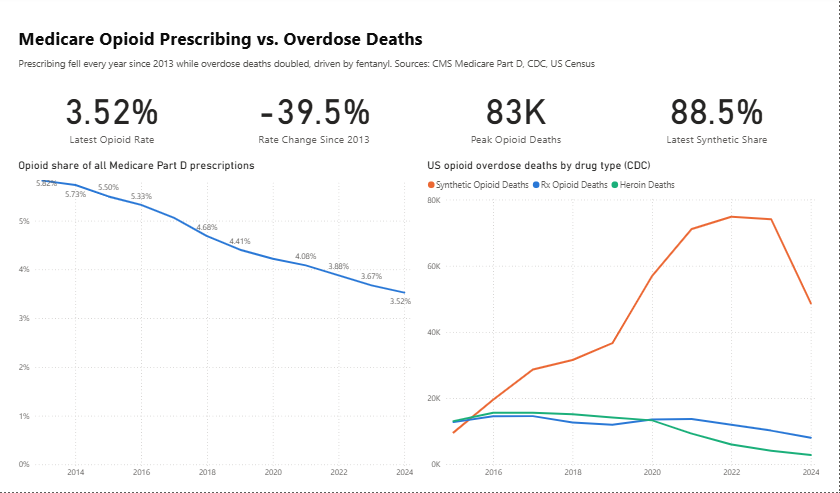
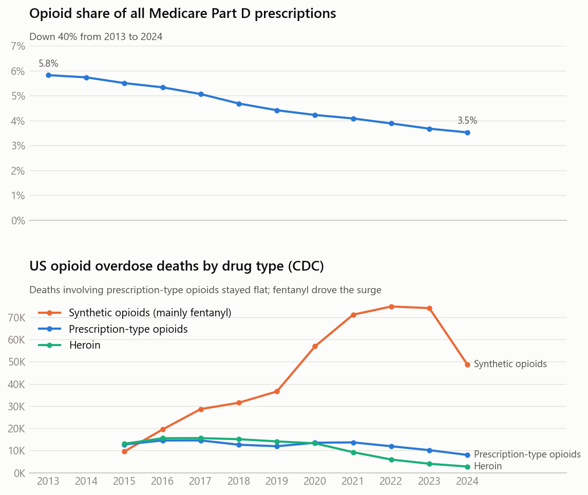
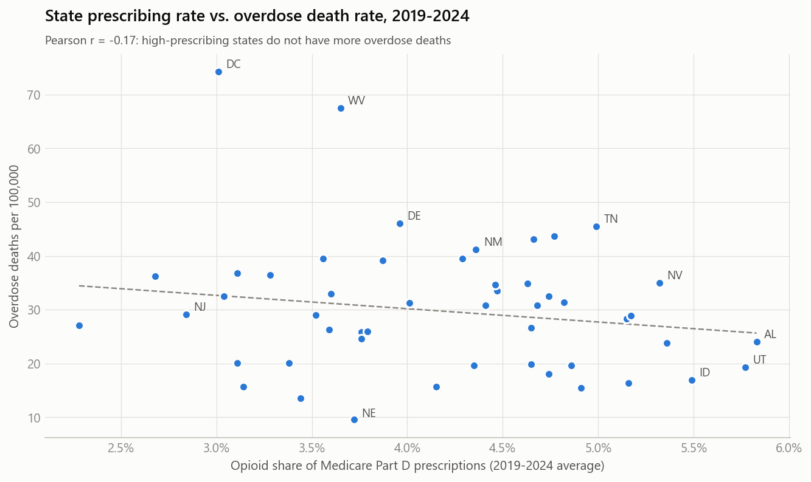
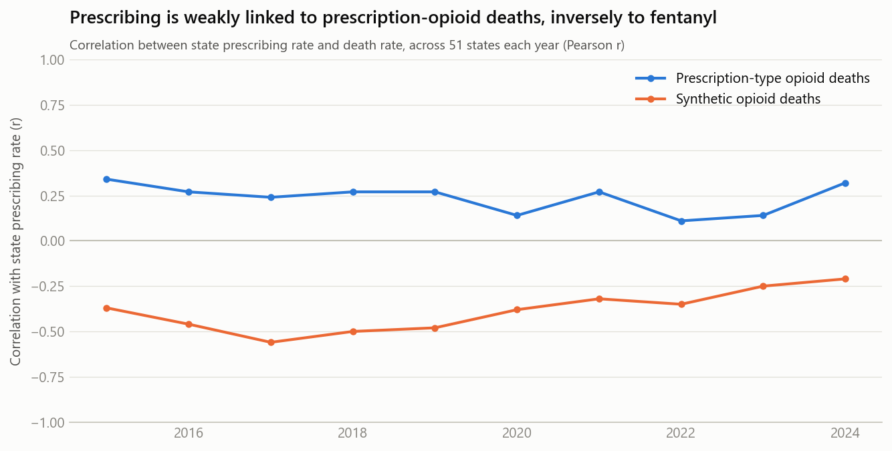
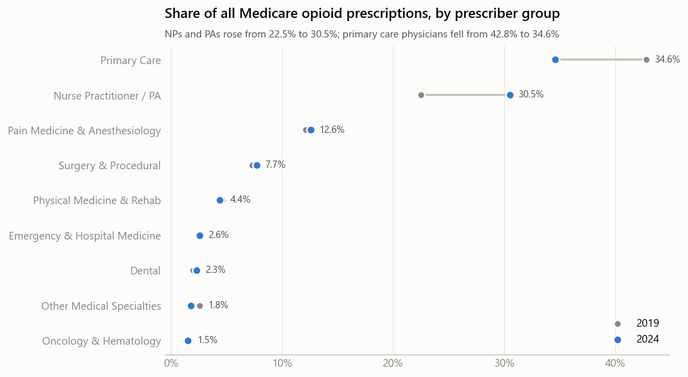
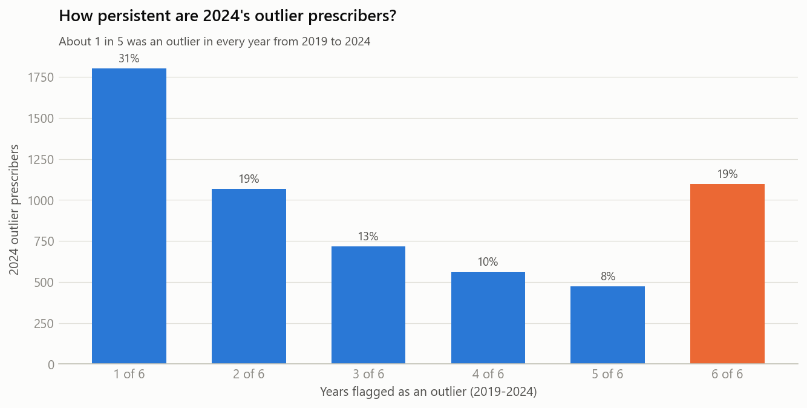
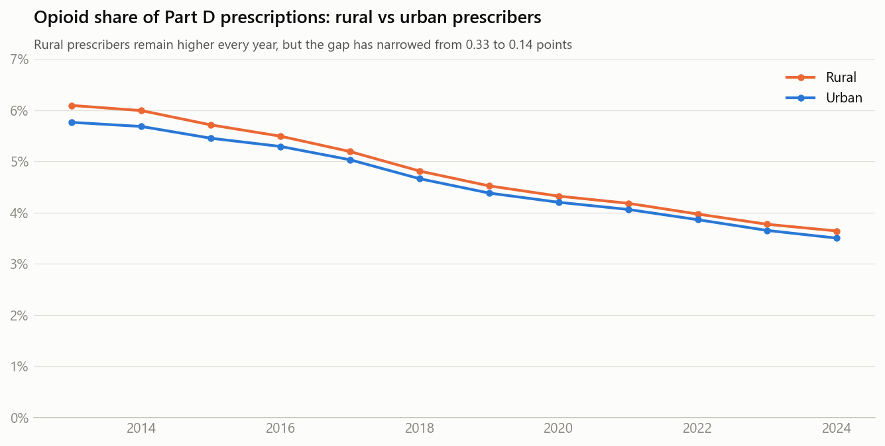
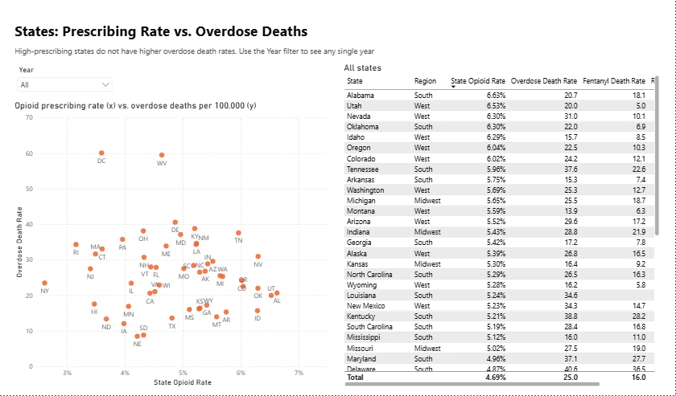
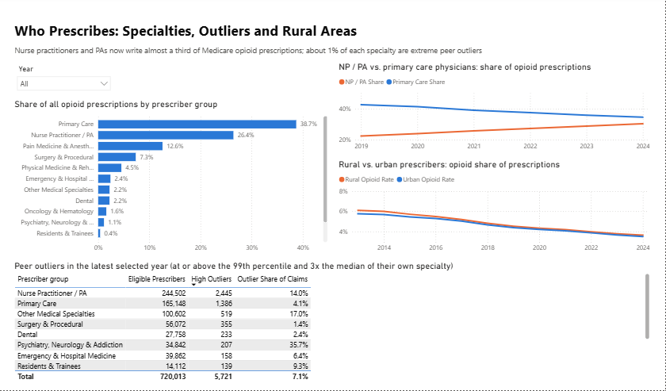

# Medicare Opioid Prescribing vs. Overdose Deaths

Analysis of **7.8 million real Medicare Part D prescriber records (2019–2024)** alongside 12 years of national prescribing
rates and CDC overdose deaths, built with **PostgreSQL, Python and Power BI**.

**Question:** US opioid prescribing has been falling for a decade. Did overdose deaths follow, and where should
payers and public-health programs focus now?



---

## Key findings

| | Finding | Evidence |
|---|---|---|
| 📉 | **Opioid prescribing in Medicare fell 39.5% from 2013 to 2024** (5.82% to 3.52% of all Part D prescriptions), and it dropped every single year. | SQL Q1 |
| 📈 | **Over the same period overdose deaths doubled**, from 52,600 in 2015 to a peak of 109,400 in 2022. The share of opioid deaths involving **synthetic opioids (mainly illicit fentanyl) rose from 29% to 92%**, while deaths from prescription-type opioids stayed roughly flat. | SQL Q1, Q12 |
| 🗺️ | **Across states, prescribing no longer predicts deaths.** A state's prescribing rate correlates *negatively* with fentanyl deaths in every year from 2015 to 2024 (r = −0.21 to −0.56), and only weakly positively with prescription-opioid deaths (r = 0.11 to 0.34). | SQL Q2 |
| 🩺 | **Nurse practitioners and PAs now write 30.5% of Medicare opioid prescriptions**, up from 22.5% in 2019, while primary care physicians fell from 42.8% to 34.6%. | SQL Q5, Q6 |
| 🎯 | **Pain medicine is concentrated.** About 10,900 prescribers (0.8% of all) write 12.6% of opioid prescriptions, and opioids make up 52% of what they prescribe. | SQL Q5 |
| 🔎 | **5,721 prescribers (0.8%) are extreme outliers against peers in their own specialty** (at or above the 99th percentile and at least 3x the specialty median). **One in five of them was flagged in every year from 2019 to 2024.** | SQL Q8, Q9 |

## Recommendations

1. **Fund overdose prevention from death and drug-supply data, not prescribing rates.** Since about 2016 the crisis has been driven by illicit fentanyl, and the states that prescribe most are not the states with the most deaths.
2. **Extend prescriber education and prescription monitoring to NPs and PAs**, who are now close to a third of Medicare opioid prescribing.
3. **Focus payer review on persistent peer outliers.** About 1,100 prescribers have been extreme outliers against their own specialty for six straight years. That is a short, defensible review list, and it avoids penalising specialties like pain medicine and hospice care where high use is expected.

---

## Data (all real, public, free)

| Source | What | Rows |
|---|---|---|
| [CMS Medicare Part D Prescribers – by Provider](https://data.cms.gov/provider-summary-by-type-of-service/medicare-part-d-prescribers/medicare-part-d-prescribers-by-provider) | One row per prescriber per year: total and opioid claims, long-acting opioids, specialty, location | 7.9M (2019–2024) |
| [CMS Medicare Part D Opioid Prescribing Rates – by Geography](https://data.cms.gov/summary-statistics-on-use-and-payments/medicare-medicaid-opioid-prescribing-rates/medicare-part-d-opioid-prescribing-rates-by-geography) | Official national and state rates, rural/urban | 2013–2024 |
| [CDC VSRR Provisional Drug Overdose Death Counts](https://data.cdc.gov/NCHS/VSRR-Provisional-Drug-Overdose-Death-Counts/xkb8-kh2a) | Deaths by state, month and drug type | 2015–2025 |
| [US Census Bureau population estimates](https://www.census.gov/programs-surveys/popest.html) | State population, for rates per 100,000 | 2015–2025 |

`Python/01_download_data.py` finds each file in the official CMS catalog and records its URL, size and SHA-256 in
[`Data/raw/manifest.json`](Data/raw/manifest.json). The raw files (4.4 GB) are not stored in this repo; the script re-downloads them.

**Privacy:** prescriber names and street addresses are deliberately not loaded. Prescribers are analysed in aggregate by
specialty and state, and outliers are counted, never named.

---

## How it's built

```
CMS / CDC / Census ──> Data/raw (4.4 GB) ──COPY──> PostgreSQL: raw ──> core (star schema) ──> analytics (views)
                                                                                                │
                                              Python notebook (charts) <────────────────────────┤
                                              Power BI (imports the views from PostgreSQL) <────┘
```

| Layer | Contents |
|---|---|
| `raw` | Source files loaded as text with PostgreSQL `COPY`, so nothing is coerced on the way in |
| `core` | Star schema: `fact_prescriber_year` (7.8M rows), `dim_specialty`, `dim_state`, overdose, population and CMS rate facts |
| `analytics` | 6 views, one per business question, plus a materialized view that benchmarks every prescriber against peers |

### Data problems found and fixed ([`SQL/02_transform.sql`](SQL/02_transform.sql))

- **Suppressed counts:** CMS blanks opioid counts of 1–10 for privacy (about 25% of prescribers). These are kept as NULL rather than zero, and the reconciliation check shows the prescriber file still covers **97.8% of CMS's published national opioid total** every year.
- **Inconsistent state codes:** the FIPS column disagrees with the state abbreviation on some rows, and military and unknown codes (AE, AP, XX, ZZ) sometimes carry real state FIPS codes. States are therefore matched through the abbreviation, with each FIPS code assigned to the abbreviation it co-occurs with most often.
- **250 specialty names:** spelling variants ("Orthopaedic" vs "Orthopedic") are merged and names grouped into 13 clinical groups. A regex trap was caught during validation: "Neurology" contains "urology" and was landing in Surgery.
- **New York City:** CDC reports NYC separately from the rest of New York, so the two are summed. Without this, New York's deaths would be undercounted by about half.
- **Withheld CDC detail:** drug-specific death counts are withheld in some state-years, so they stay NULL and are excluded from rate denominators rather than treated as zero.

All checks are in [`SQL/03_data_quality.sql`](SQL/03_data_quality.sql), with results in [`SQL/query_results.md`](SQL/query_results.md).

### SQL skills shown
PostgreSQL `COPY` bulk loading, schemas and a star schema, unlogged staging tables, CTEs, window functions (`LAG`,
`FIRST_VALUE`, `RANK`, `NTILE`, `percent_rank`), `FILTER` aggregates, `percentile_cont`, statistical aggregates
(`corr`, `regr_slope`), `DISTINCT ON`, regex classification, materialized views and indexes.

---

## Charts

| | |
|---|---|
|  |  |
|  |  |
|  |  |

## Power BI dashboard

Saved as a Power BI Project (`.pbip`) that **imports the analytics views directly from PostgreSQL**, with the server and
database as parameters. Three pages: National Trend, States and Prescribers. Every measure was checked against the SQL results.

**States**


**Prescribers**


---

## Project structure

```
Medicare_Opioid_Prescribing/
├── Data/
│   ├── raw/manifest.json      # sources, sizes and checksums (raw files re-downloaded, not committed)
│   └── analytics/             # CSV exports of every analytics view
├── SQL/
│   ├── 00_create_database.sql # one-time setup (database + tablespace)
│   ├── 01a_schema_raw.sql, 01b_schema_core.sql
│   ├── 02_transform.sql       # cleaning rules
│   ├── 03_data_quality.sql    # 10 checks
│   ├── 04_analytics_views.sql # 6 views + peer-benchmark materialized view
│   ├── 05_business_questions.sql  # 12 queries
│   └── query_results.md       # every query with its output
├── Python/                    # download, load, run SQL, analysis notebook, Power BI generator, export
├── dashboard/                 # Power BI project
├── Image/                     # charts and dashboard screenshots
└── run_all.py
```

## Reproduce it

1. Install PostgreSQL 16+ and Python 3.11+, then `pip install -r requirements.txt`.
2. Create the database once: `psql -U postgres -f SQL/00_create_database.sql`. Edit the tablespace path first; the database needs about 6 GB.
3. Save your password in `pgpass.conf` (Windows: `%APPDATA%\postgresql\pgpass.conf`), or set the `PGPASSWORD` environment variable.
4. Run `python run_all.py`. It downloads about 4.4 GB and takes roughly 20–30 minutes.
5. Optional: open `dashboard/Opioid_Prescribing.pbip` in Power BI Desktop, sign in to PostgreSQL when prompted, and click Refresh.

## Limitations

- **Medicare Part D only.** It covers mostly adults 65+ and people with disabilities, so it doesn't represent all US prescribing.
- **Aggregate data.** State-level correlations are ecological: they describe states, not individual patients.
- **Provisional 2024–2025 CDC counts** may still be revised.
- **Outliers are not wrongdoing.** "Outlier" is a statistical flag for review; high opioid use can be clinically appropriate.
